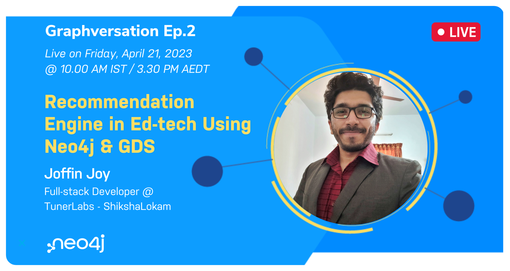

# SL O-Horizon Recommendation Engine

## Overview

The **SL O-Horizon Recommendation Engine** was developed as part of the project titled **"SL O-Horizon: Enhancing Discovery On [Beckn](https://becknprotocol.io) Enabled Open Networks Through Recommendations Using Neo4j & GDS"**. It was created during [**Skill-A-Thon 1.0**](https://www.hackerearth.com/challenges/hackathon/skill-a-thon-10/), which was a hackathon organized by the EkStep Foundation and the DSEP (Decentralized Skilling and Education Protocol) community.

**SL O-Horizon** project emerged as the winner in the challenge 4 category of Skill-A-Thon, which focused on **"Unlock opportunities for the next billion by building intelligent technology solutions to find and deliver services"**. Subsequently, the project and the engine was featured in Episode 2 of **[Neo4j's](https://neo4j.com/)** hour-long live-stream series called **[Graphversation](https://www.youtube.com/watch?v=SoU-hrfZ14c)**.

**Neo4j Graphversation Ep. 2 (Recommendation Engine in Ed-tech Using Neo4j & GDS):** [Watch here (Youtube)](https://www.youtube.com/watch?v=SoU-hrfZ14c)

This repository serves as the reference for the SL O-Horizon Recommendation Engine, aligning with the contents discussed in the Graphversation episode.

<p align="center">
  
&nbsp; &nbsp; &nbsp; &nbsp;
  
</p>

## Workflows Supported

-   **Collaborative filtering** based recommendations i.e., recommendations based on user to user similarity.

    **Scenario Supported:** Item recommendations for a user based on how similar they are to other users and their preferred items. (Input: **UserId**)

    **GDS Algorithms used:** [Fast Random Projection Embedding](https://neo4j.com/docs/graph-data-science/current/machine-learning/node-embeddings/fastrp/) (**FRP**) & [K-Nearest Neighbors](https://neo4j.com/docs/graph-data-science/current/algorithms/knn/) (**KNN**)

-   **Content based filtering** recommendations i.e., recommendations based on similarities between the contents of the items.

    **Scenarios Supported:**

    -   **Item details page recommendations:** Recommend items which are similar to the selected item. (Input: **ItemId**)
    -   **Profile page recommendations:** Recommend items which are similar to the items previously rated by the user. (Input: **UserId**)

    **GDS Algorithms used:** [Node Similarity](https://neo4j.com/docs/graph-data-science/current/algorithms/node-similarity/)

-   **Smart Auto-search:** Using this workflow, the recommendation engine identifies the relevant topics in the graph database. And it will make search queries to an external service (SL O-Horizon BAP) on those topics. Which will result in recommendation engine getting enriched with newer items as time passes, thus self-improving the recommendations for the users.

    **GDS Algorithms used:** [PageRank](https://neo4j.com/docs/graph-data-science/current/algorithms/page-rank/) & [Node Similarity](https://neo4j.com/docs/graph-data-science/current/algorithms/node-similarity/)

    **Note:** Since "Smart Auto-Search" wasn't mentioned during the Graphversation Episode, use this article as the reference for the **working**, **architecture** & **feature walkthrough**: [**Leveraging “Smart Auto-Search” On O-Horizon Recommendation Engine**](https://medium.com/@joffinjoy/leveraging-smart-auto-search-on-o-horizon-recommendation-engine-def51a19399)

## Additional Features

-   **Synthetic data generation scripts:** The dataset demonstrated during Graphversation can be generated with a single command.
    
-   **Swagger Api-doc:** This repository comes with a fully fledged swagger api-doc which can be accessed from the web-browser.
    
-   **Postman collection:** Postman collection with all APIs are included with this repository.

## Prerequisites

1.  Node.js 18
2.  Docker Compose
3.  Neo4j GraphDB & GDS (Included in docker-compose file)

## Setup Guide

1. Install [Node.js](https://nodejs.org/en) & [Docker Compose](https://docs.docker.com/compose/install/).
2. Clone the repo and run "npm i" command from within the src directory.
    ```
    o-horizon-recommendation/src$ npm i
    ```
3. Now run the 'docker-compose up' command from the root directory.
    ```
    o-horizon-recommendation$ docker-compose up
    ```
4. Set unique constraints for the graph database (graphDB) by running the following command from the src directory:

    ```
    o-horizon-recommendation/src$ npm run set-unique-constraints
    ```

5. [**Optional**] To replicate the same dataset used during Graphversation, run:
    ```
    o-horizon-recommendation/src$ npm run graph-seeder
    ```
6. [**Optional**] To access swagger api-docs, visit the following url from the web-browser.
    > http://localhost:3020/recommendation/api-docs/
7. [**Optional**] Import api collection from src/apidocs into postman.

    > o-horizon-recommendation/src/apidocs/O-Horizon.postman_collection.json

8. [**Optional**] To access Neo4j browser, visit the following url from the web-browser. (Login without username & password)
    > http://localhost:7474/browser

## Additional References

-   Beckn Protocol: https://becknprotocol.io
-   DSEP Specification: https://becknprotocol.io/dsep-specification
-   Neo4j Cypher Query Language: https://neo4j.com/developer/cypher
